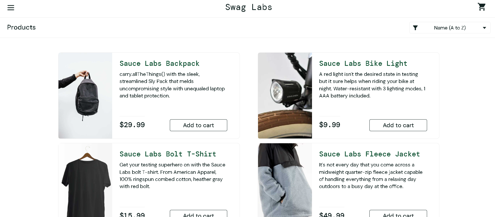
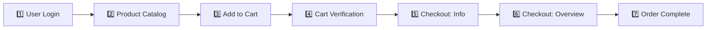

# 🛒 Manual Testing Portfolio: SauceDemo E-Commerce Workflow

-success?style=for-the-badge&logo=checkmarx)

-red?style=for-the-badge&logo=jira)

 

---

## 📌 Executive Summary

Welcome to the **SauceDemo E-Commerce Workflow Manual Testing Project** 🚀.

This project demonstrates an **end-to-end, industry-standard QA testing lifecycle** performed on the **SauceDemo E-commerce Web Application**. Structured across a simulated **6-Day Sprint** following the **Software Testing Life Cycle (STLC)**, this repository covers the complete customer journey:
**User Authentication ➔ Product Browsing & Filtering ➔ Cart Management ➔ Multi-Step Checkout ➔ Order Confirmation**.

### 🌐 Application Under Test (AUT)
- **Application Name:** SauceDemo (Swag Labs)
- **Application URL:** [https://www.saucedemo.com/](https://www.saucedemo.com/)
- **Environment:** QA / Staging Test Environment
- **Target Browsers:** Google Chrome (v128.0), Microsoft Edge (v127.0)
- **Operating System:** Windows 10 / 11 (64-bit)

 

  
  
<em>Figure 1: Application Under Test (AUT) — SauceDemo E-Commerce Web Store</em>

---

## 📊 Test Execution Dashboard & Key Metrics

### 📈 Overall Testing Statistics

| Metric | Value | Status |
| :--- | :---: | :---: |
| **Total Test Scenarios** | **82** | Documented |
| **Total Test Cases Designed** | **108** | Complete |
| **Total Test Cases Executed** | **108** | 100% Execution |
| **Passed Test Cases** | **104** | ✅ |
| **Failed Test Cases** | **4** | ❌ (Product Module) |
| **Blocked / Not Executed** | **0** | Clean Run |
| **Overall Pass Rate** | **96.29%** | High Stability |
| **Defects Logged in Jira** | **4** | Tracked |

 

### 📑 Module-Wise Test Execution Breakdown

| Module | Total TCs | Passed | Failed | Blocked | Pass % | Status |
| :--- | :---: | :---: | :---: | :---: | :---: | :---: |
| 🔐 **Login Module** | 15 | 15 | 0 | 0 | **100%** | Passed |
| 🛍️ **Product Listing & Sorting** | 18 | 14 | 4 | 0 | **77.78%** | 4 Defects Logged |
| 🛒 **Cart Management** | 18 | 18 | 0 | 0 | **100%** | Passed |
| 📝 **Checkout: Your Information** | 20 | 20 | 0 | 0 | **100%** | Passed |
| 💳 **Checkout: Overview & Calculations** | 23 | 23 | 0 | 0 | **100%** | Passed |
| 🎉 **Checkout: Complete & Confirmation** | 14 | 14 | 0 | 0 | **100%** | Passed |
| **TOTAL** | **108** | **104** | **4** | **0** | **96.29%** | Complete |

---

## 🔄 End-to-End E-Commerce Workflow Tested

1. **User Authentication:** Verified Standard, Locked-Out, Problem, Performance Glitch, and Error users with valid/invalid inputs.
2. **Product Catalog & Browsing:** Tested catalog rendering, item images, titles, pricing, and 4 sort options (A-Z, Z-A, Low-High, High-Low).
3. **Cart Operations:** Validated adding/removing items from both inventory list and detail pages, real-time cart badge counter synchronization.
4. **Cart Verification:** Validated quantity, pricing, removal buttons, and continue shopping vs checkout redirection.
5. **Checkout — Step One (User Info):** Verified First Name, Last Name, Postal Code mandatory validations, whitespace trimming, and cancellation.
6. **Checkout — Step Two (Overview):** Verified item calculations, tax calculation logic, payment info, shipping method, and total cost verification.
7. **Order Completion:** Verified completion message, order dispatch confirmation banner, back home button, and cart badge reset to empty.

---

## 📂 STLC Phase-Wise Deliverables

All documentation and execution artifacts are maintained in standard corporate QA formats:

| STLC Phase | Day | Deliverable Name | File Links / Formats | Description |
| :--- | :---: | :--- | :--- | :--- |
| **1. Requirement Analysis** | Day 1 | Software Requirements Specification (SRS) | [SRS_SauceDemo.docx](SRS_SauceDemo.docx) \| [SRS_SauceDemo.pdf](SRS_SauceDemo.pdf) | Detailed functional & non-functional requirements of the workflow. |
| **2. Test Planning** | Day 2 | Comprehensive Test Plan | [TestPlan_SauceDemo.docx](TestPlan_SauceDemo.docx) \| [TestPlan_SauceDemo.pdf](TestPlan_SauceDemo.pdf) | Scope, objectives, schedule, test strategy, entry/exit criteria, and risks. |
| **3. Test Scenario Design** | Day 3 | High-Level Test Scenarios | [TestScenario_SauceDemo.xlsx](TestScenario_SauceDemo.xlsx) | **82 Test Scenarios** covering all 6 core modules end-to-end. |
| **4. Test Case Design** | Day 4 | Detailed Test Cases | [TestCases_SauceDemo.xlsx](TestCases_SauceDemo.xlsx) | **108 Test Cases** with preconditions, test steps, test data, and expected results. |
| **5. Test Execution & Defects** | Day 5 | Test Execution & Jira Defect Log | [TestExecution.xlsx](TestExecution.xlsx) | Real-time execution logs (Pass/Fail) and defect logging in Jira. |
| **6. Test Closure** | Day 6 | Test Summary Report (TSR v1.1) | [TestSummaryReport_SauceDemo_v1.1.docx](TestSummaryReport_SauceDemo_v1.1.docx) \| [TestSummaryReport_SauceDemo_v1.1.pdf](TestSummaryReport_SauceDemo_v1.1.pdf) | Formal test closure documentation, metrics, defect analysis, and recommendations. |

---

## 🐛 Defects Logged in Jira

During test execution, **4 functional defects** were identified, documented, and tracked:

| Bug ID | Module | Summary / Defect Description | Severity | Priority | Status |
| :---: | :---: | :--- | :---: | :---: | :---: |
| **BUG-01** | Product Listing | Incorrect product name displayed for Product #6 | **High** | **High** | Open |
| **BUG-02** | Product Listing | Incorrect product description displayed for Product #1 | **Medium** | **Medium** | Open |
| **BUG-03** | Footer / Links | "Terms of Service" footer hyperlink is not clickable | **Low** | **Low** | Open |
| **BUG-04** | Footer / Links | "Privacy Policy" footer hyperlink is not clickable | **Low** | **Low** | Open |

---

## 🔍 Critical Tester Observations & Exploratory Insights

In addition to formal test cases, exploratory testing uncovered significant business logic and usability insights:

> ### ⚠️ OBS-01: Absence of Field-Level Input Validation
> **Issue:** Both the Login page and Checkout (Information) page display generic banner-style error notifications on invalid/empty submissions.
> **Impact:** Users are not visually guided to the exact offending input field, degrading user onboarding experience.

> ### ⚠️ OBS-02: Broken Error State for Invalid Product URLs
> **Issue:** Direct URL navigation to unmapped product IDs (e.g., `https://www.saucedemo.com/inventory-item.html?id=77`) displays an unhandled 404/broken page with placeholder dog imagery.
> **Impact:** Lacks graceful user recovery or automated redirection to the inventory catalog.

> ### ⚠️ OBS-03: Empty Cart Checkout Allowed (Business Logic Flaw)
> **Issue:** The application allows a user to proceed through the checkout flow and successfully place an order with 0 items ($0.00 total).
> **Impact:** In a commercial production system, empty-order dispatch creates logistical anomalies and database pollution.

---

## 📝 Sample Test Cases Showcase

| Test Case ID | Module | Test Scenario / Description | Test Steps | Expected Result | Status |
| :---: | :---: | :--- | :--- | :--- | :---: |
| **TC_LOGIN_01** | Login | Verify user can login with valid credentials | 1. Enter valid username 2. Enter valid password 3. Click 'Login' | User is successfully authenticated and redirected to Product Listing page (`/inventory.html`). | **Pass** |
| **TC_LOGIN_05** | Login | Verify login with locked out user | 1. Enter `locked_out_user` 2. Enter valid password 3. Click 'Login' | Error message displayed: *"Epic sadface: Sorry, this user has been locked out."* | **Pass** |
| **TC_PROD_03** | Product | Verify product sorting by Price (Low to High) | 1. Click Sort dropdown 2. Select 'Price (low to high)' | Products are dynamically sorted in ascending order of price ($7.99 to $49.99). | **Pass** |
| **TC_CART_02** | Cart | Verify shopping cart badge updates on item removal | 1. Add 2 items to cart 2. Click 'Remove' on 1 item | Cart badge count decrements from '2' to '1' immediately. | **Pass** |
| **TC_CHK_04** | Checkout | Verify mandatory validation for Postal Code | 1. Fill First & Last Name 2. Leave Zip Code blank 3. Click 'Continue' | Error banner displayed: *"Error: Postal Code is required"*. Navigation prevented. | **Pass** |

---

## 🛠️ Testing Tools & Environment

| Tool / Technology | Purpose |
| :--- | :--- |
| **Excel / Google Sheets** | Designing Test Scenarios, Detailed Test Cases, and Test Execution Matrix |
| **Atlassian Jira** | Defect Logging, Severity/Priority Categorization, and Bug Tracking |
| **MS Word / Google Docs** | Authoring SRS, Test Plan, and Test Summary Report (TSR) |
| **GitHub** | Version Control, Asset Management, and Repository Portfolio Documentation |
| **Chrome & Edge DevTools** | Responsive Viewport Testing, Network Status Checks, and UI Inspection |

---

## 🎯 Key Learning Outcomes & Competencies

- Mastered **Software Testing Life Cycle (STLC)** implementation from day-one planning to formal closure.
- Formulated industry-grade **Test Plans** and **Software Requirement Specifications (SRS)**.
- Designed exhaustive test coverage using **Equivalence Partitioning (EP)** and **Boundary Value Analysis (BVA)**.
- Executed systematic **Functional, Positive, Negative, UI/UX, and Regression Testing**.
- Logged actionable bug reports in **Jira** with complete reproduction steps and triage categorization.
- Uncovered deeper business logic edge cases through structured **Exploratory Testing**.

---

## 📌 Project Status
✅ **Completed (Intermediate Level QA Project)**  
All STLC deliverables have been compiled, executed, verified, and archived in this repository.

---

## 👩‍💻 Author

**Sanskriti Bhardwaj**  
🎓 Aspiring QA Engineer & Automation Tester  

- 💼 **LinkedIn:** [linkedin.com/in/sanskriti-bhardwaj01](https://www.linkedin.com/in/sanskriti-bhardwaj01/)  
- 🐙 **GitHub:** [github.com/Sanskriti-Bhardwaj](https://github.com/Sanskriti-Bhardwaj)  
- 📧 **Email:** [bhardwajsanskriti6@gmail.com](mailto:bhardwajsanskriti6@gmail.com)

---

  Tested and maintained with ❤️ by Sanskriti Bhardwaj | Manual Testing Portfolio

